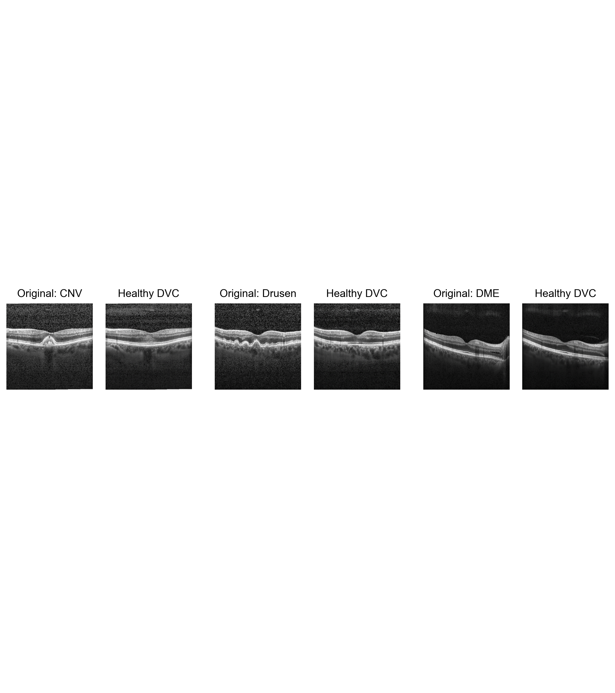

# **Realistic Diffusion Counterfactuals for Retinal Fundus and OCT Images**

This code repository is associated with the paper ["Generating Realistic Counterfactuals for Retinal 
Fundus and OCT Images using Diffusion Models"](https://arxiv.org/abs/2311.11629). 
It is based on the ["Diffusion Visual Counterfactual Explanations"](https://github.com/valentyn1boreiko/DVCEs)
repository. 

Here we provide the models and code to generate diffusion counterfactuals using retinal fundus images 
or OCT scans. 

## **Examples**

### Retinal Fundus Counterfactuals
<p align="center">
  
</p>

<p align="center">
  
</p>

### OCT counterfactuals
<p align="center">
  
</p>

<p align="center">
  
</p>


## **Usage**

### Requirements and installations
Download models from the following link or use the following code_snippet:
TO DO
The downloaded directory contains 4 models trained on retinal fundus images: plain binary model, robust binary model, 
plain 5-class model and robust 5-class model. There are 2 models trained on OCT data: plain and robust 4-class classifiers. 
 
### Generate diffusion counterfactuals 
To generate fundus diffusion counterfactuals of the sample images provided in samples_fundus directory, run the following snippet
```
python imagenet_VCEs_eyepacs.py --config 'eyepacs_dvces_binary_cone_proj.yml' --denoise_dist_input --batch_size 5
```

To generate OCT diffusion counterfactuals of the sample OCT images provided in samples_oct directory, run the following code snippet:
```
python imagenet_VCEs_eyepacs.py --config 'oct_dvces_4class_cone_proj.yml' --denoise_dist_input --batch_size 4
```


