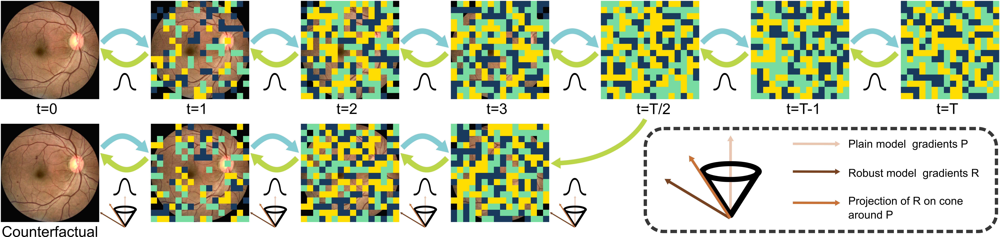
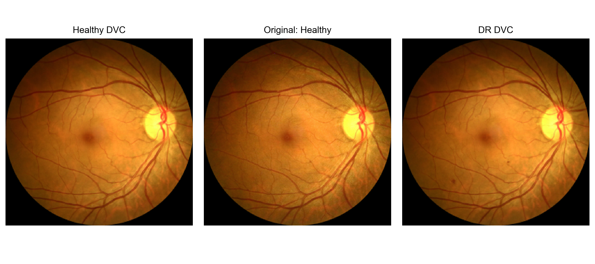
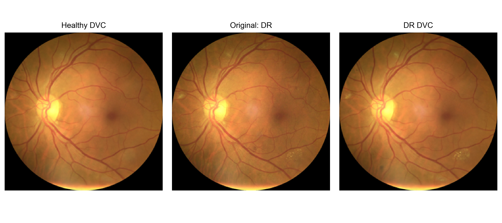
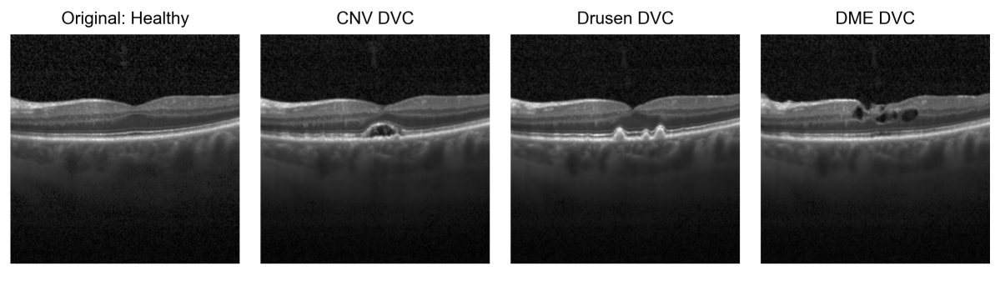

# **Realistic Diffusion Counterfactuals for Retinal Fundus and OCT Images**

This code repository is associated with the paper ["Generating Realistic Counterfactuals for Retinal 
Fundus and OCT Images using Diffusion Models"](https://arxiv.org/abs/2311.11629). 
and is based on the ["Diffusion Visual Counterfactual Explanations"](https://github.com/valentyn1boreiko/DVCEs)
repository.  

Here we provide the code and models to generate diffusion counterfactuals using retinal fundus images 
and OCT scans. 

For retinal fundus images, we focus on the task of Diabetic Retinopathy Detection and grading. The classes are the 5-stages of Diabetic Retinopathy, namely, "healthy", "mild", "moderate", "severe" and "proliferative". For binary classification, we use a classifier with 'onset 2' labeling i.e. we consider both "healthy" and "mild" as "healthy" while grouping "moderate", "severe" and "proliferative" into the diseased class. With this code, counterfactuals can be generated in both 5-class and binary settings. Note that the generation capabilties of the method for "proliferative" and "severe" counterfactuals are limited due to the scarcity of these classes in the data set used to train the models. 

For OCT scans, counterfactuals can be generated to 4 different classes: "normal", "choroidal neovascularization (CNV)", "drusen" and "diabetic macular edema (DME)". 

## **Diffusion Counterfactuals**
<p align="center">
  
</p>

To generate counterfactuals using diffusion models and classifiers, we use the method proposed in the NeurIPS paper [Diffusion Visual Counterfactual Explanations](https://proceedings.neurips.cc/paper_files/paper/2022/hash/025f7165a452e7d0b57f1397fed3b0fd-Abstract-Conference.html). The main components are diffusion models, plain classifiers and adversarially robust classifiers. The reverse diffusion of the diffusion model is modified during sampling by slightly shifting the mean of the reverse transition probabilties. The shift in the mean is determined by the gradients of a classifier with respect to the image. Instead of directly using the gradients of the plain or adversarially robust classifier, we use the gradients of a adversarially robust classifier projected on a cone around the gradients of a plain classifier. 

## **Examples**

### Retinal Fundus Counterfactuals

Diffusion Counterfactuals from a healthy fundus image:
<p align="center">
  
</p>

Diffusion Counterfactuals from a DR fundus image:
<p align="center">
  
</p>

### OCT counterfactuals
<p align="center">
  
</p>


## **Usage**

### Requirements and installations
Requirements can be found in requirements.txt and can be installed with: 
```
pip install -r requirements.txt
```

Adversarially robust models are trained using pretrained weights on ImageNet data from the [robustness library](https://github.com/MadryLab/robustness).
The model file for ImageNet L2 norm with $\varepsilon=3.0$ is a pre-requisite for loading the adversarially robust models trained on retinal fundus and OCT data.

Create a new directory *ImageNet1000Models/MadryRobustResNet50/* and download [this file](https://www.dropbox.com/s/knf4uimlqsi1yz8/imagenet_l2_3_0.pt?dl=0) to the directory *ImageNet1000Models/MadryRobustResNet50/*.


Within the project directory download the diffusion models, EyePacs classifiers and OCT classifiers and unzip them. 
Alternatively you may use these commands to download and uncompress the required models:
```
wget -O checkpoints.zip https://zenodo.org/records/10256824/files/checkpoints.zip?download=1
unzip OCTModels.zip 
```
```
wget -O EyePacsModels.zip https://zenodo.org/records/10256824/files/EyePacsModels.zip?download=1
unzip EyePacsModels.zip
```

```
wget -O OCTModels.zip https://zenodo.org/records/10256824/files/OCTModels.zip?download=1
unzip OCTModels.zip
```

*checkpoints.zip* consists of 2 diffusion models: 

Retinal fundus diffusion model: ema\_0.9999\_290000\_eyepacs\_extra\_data\_balancing\_4\_classes\_v1.pt
OCT diffusion model: ema\_0.9999\_270000\_oct\_v1.pt

*EyepacsModels.zip* consists of four models trained on EyePacs retinal fundus data set:

Binary plain classifier: rmtIN1000:ResNet50/plain\_17-01-2023\_16:22:33/best.pth
Binary robust classifier: MadryRobust:l2/\_temp\_TRADES\_02-06-2023\_12:10:59/best.pth
5-class plain classifier: rmtIN1000:ResNet50/plain\_24-01-2023\_20:42:28/best.pth
5-class robust classifier: MadryRobust:l2/\_temp\_TRADES\_17-02-2023\_18:30:38/best.pth

*OCTModels.zip* consists of two model trained on Optical Coherence Tomography scans:

4-class plain classifier: ResNet50/plain\_29-11-2022\_21:53:46/best.pth
4-class robust classifier: ResNet50/\_temp\_TRADES\_02-12-2022\_15:53:20/best.pth

*EyepacsModels.zip* and *OCTModels.zip* also contain the temperature files for all the models within that folder. 

 
### Generate diffusion counterfactuals 
To generate fundus diffusion counterfactuals of the sample images provided in samples_fundus directory, run the following snippet
```
python generate_counterfactuals.py --config 'eyepacs_dvces_binary_cone_proj.yml' --denoise_dist_input --batch_size 5
``` 
To save difference maps, use the flag --save_diffs:
```
python generate_counterfactuals.py --config 'eyepacs_dvces_binary_cone_proj.yml' --denoise_dist_input --batch_size 5 --save_diffs
```

To generate OCT diffusion counterfactuals of the sample OCT images provided in samples_oct directory, run the following code snippet:
```
python generate_counterfactuals.py --config 'oct_dvces_4class_cone_proj.yml' --denoise_dist_input --batch_size 4
```
Fundus counterfactuals are saved in *FundusCounterfactuals/* and OCT counterfactuals are saved in *OCTCounterfactuals/*. A .csv file with model predictions and probabilities on both original image and generated counterfactual is also saved to the respective directories. 

Other configuration files for 5-class counterfactuals and generating sparse counterfactuals are present in *configs/*. 


