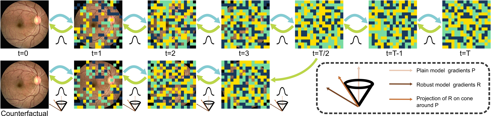
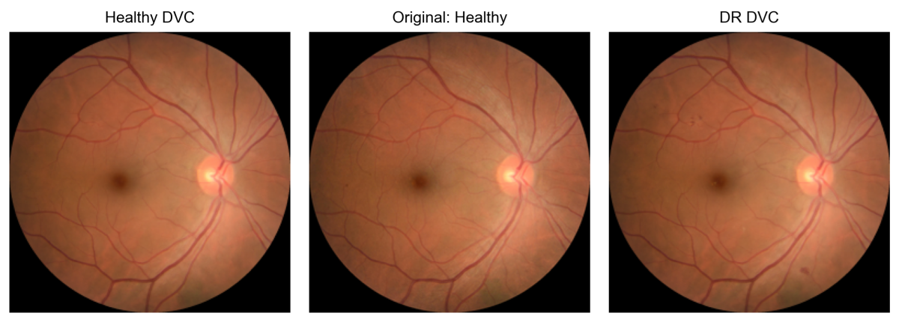
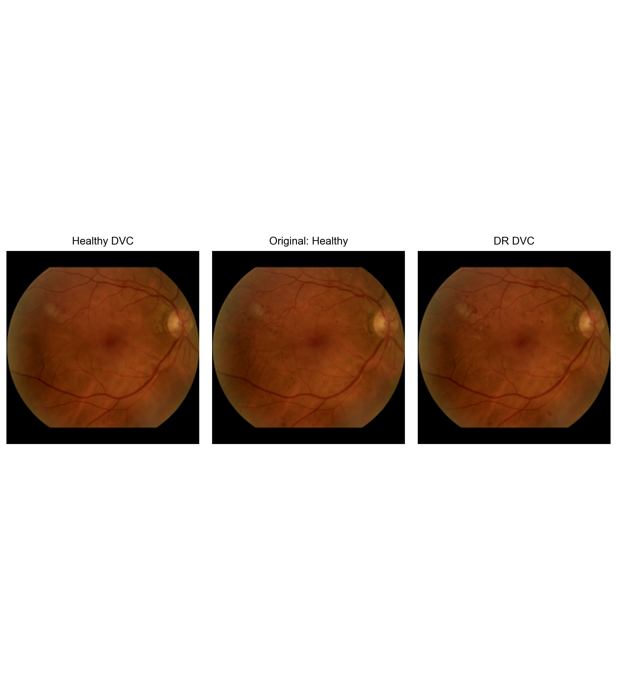
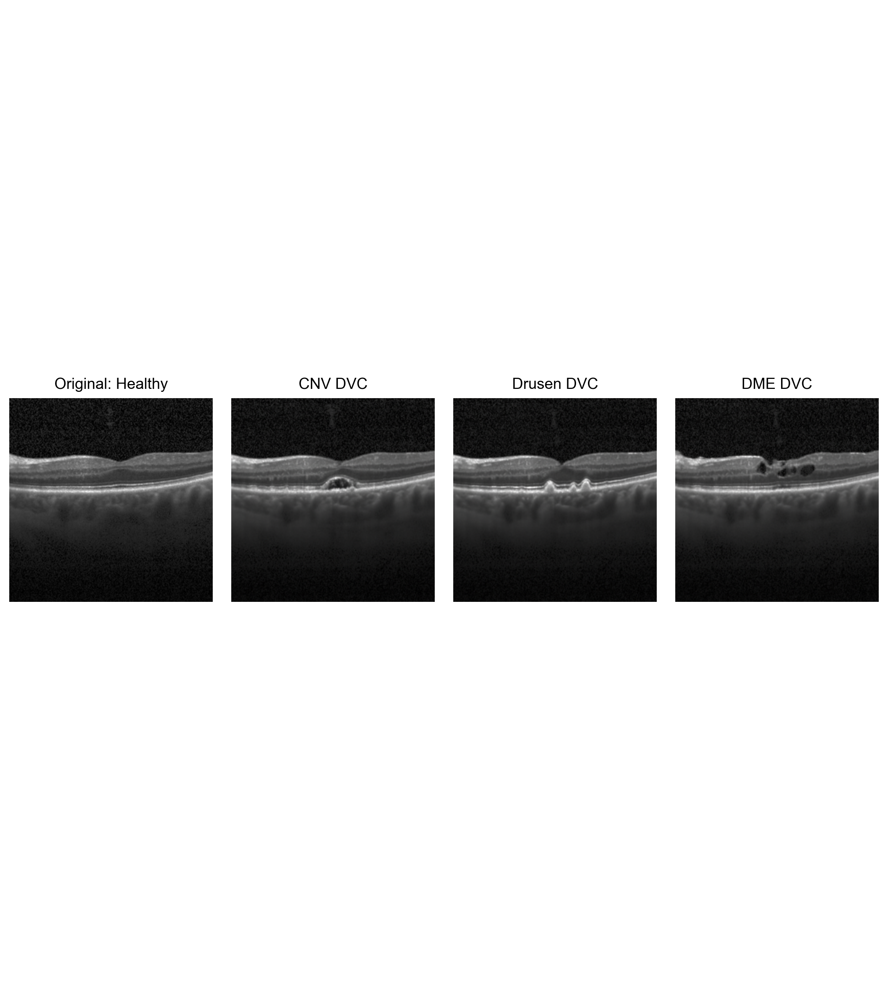

# **Realistic Diffusion Counterfactuals for Retinal Fundus and OCT Images**

This code repository is associated with the paper ["Generating Realistic Counterfactuals for Retinal 
Fundus and OCT Images using Diffusion Models"](https://arxiv.org/abs/2311.11629). 
and is based on the ["Diffusion Visual Counterfactual Explanations"](https://github.com/valentyn1boreiko/DVCEs)
repository.  

Here we provide the code and models to generate diffusion counterfactuals using retinal fundus images 
and OCT scans. 

For retinal fundus images, we focus on the task of Diabetic Retinopathy Detection and grading. The classes are the 5-stages of Diabetic Retinopathy, namely, "healthy", "mild", "moderate", "severe" and "proliferative". For binary classification, we use a classifier with 'onset 2' labeling i.e. we consider both "healthy" and "mild" as "healthy" while grouping "moderate", "severe" and "proliferative" into the diseased class. With this code, counterfactuals can be generated in both 5-class and binary settings. Note that the generation capabilties of the method for "proliferative" and "severe" counterfactuals are limited due to the scarcity of these classes in the data set used to train the models. 

For OCT scans, counterfactuals can be generated to 4 different classes: "normal", "choroidal neovascularization (CNV)", "drusen" and "diabetic macular edema (DME)". 

## **Diffusion Counterfactuals**
<p align="center">
  
</p>

## **Examples**

### Retinal Fundus Counterfactuals
<p align="center">
  
</p>

<p align="center">
  
</p>

### OCT counterfactuals
<p align="center">
  
</p>


## **Usage**

### Requirements and installations
Link to the models and requirements will be provided here soon.
Diffusion models are in checkpoints/, fundus classifiers in EyePacsModels/ and OCT classifiers in OCTMOdels/. The MadryRobustNet which is pretrained on ImageNet with adversarially robust losses is present in ImageNet1000Models/. The classifier directories also contain the temperature files. 
 
### Generate diffusion counterfactuals 
To generate fundus diffusion counterfactuals of the sample images provided in samples_fundus directory, run the following snippet
```
python generate_counterfactuals.py --config 'eyepacs_dvces_binary_cone_proj.yml' --denoise_dist_input --batch_size 5
```
To save difference maps, use the flag --save_diffs:
```
python generate_counterfactuals.py --config 'eyepacs_dvces_binary_cone_proj.yml' --denoise_dist_input --batch_size 5 --save_diffs
```

To generate OCT diffusion counterfactuals of the sample OCT images provided in samples_oct directory, run the following code snippet:
```
python generate_counterfactuals.py --config 'oct_dvces_4class_cone_proj.yml' --denoise_dist_input --batch_size 4
```

Other configuration files for 5-class counterfactuals and generating sparse counterfactuals are present in configs/. 


